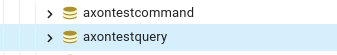

# Axon Example
Axon example based on [Axon Framework 4.6](https://docs.axoniq.io/reference-guide/v/4.6/)
Query and command application shared the same code.
There are annotations @Profile for create the key beans
and different application-[query|command].yaml this modified the behaviour of the
application to reach the correct behaviour.
Each application Command and Query (you can have multiple instances of each application at the same time)
have a PostgreS Database.

### Axon query 
CQRS - query 

--spring.profiles.active=query

### Axon command
CQRS - command

--spring.profiles.active=command

